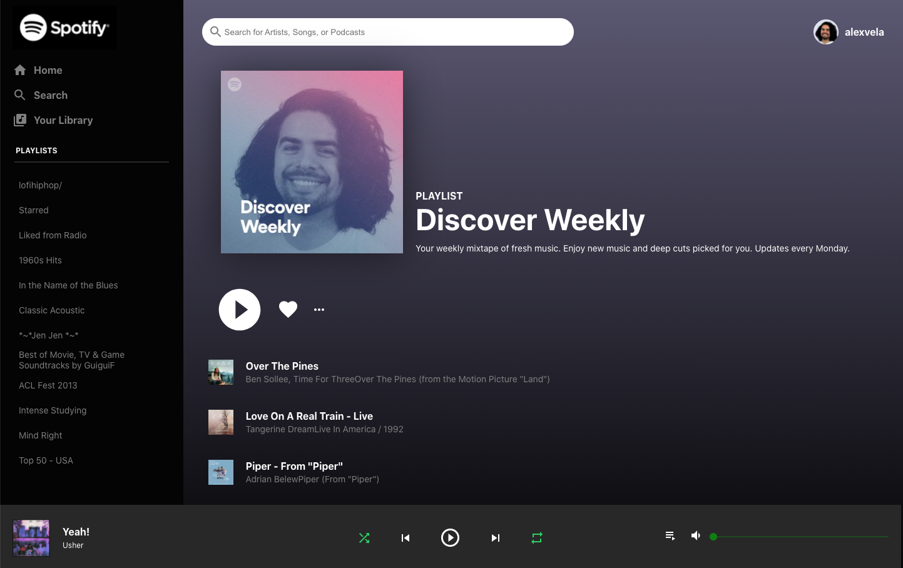

You can use this site at https://empty-wind-6029.on.fleek.co/

To run on a local machine
1. git clone the repository
2. cd into the directory
3. run npm install
4. run npm start

This project used the following:

1. React JS
2. Context API
3. Spotify API
4. User Authentication
5. Flexbox (CSS)
6. Material UI